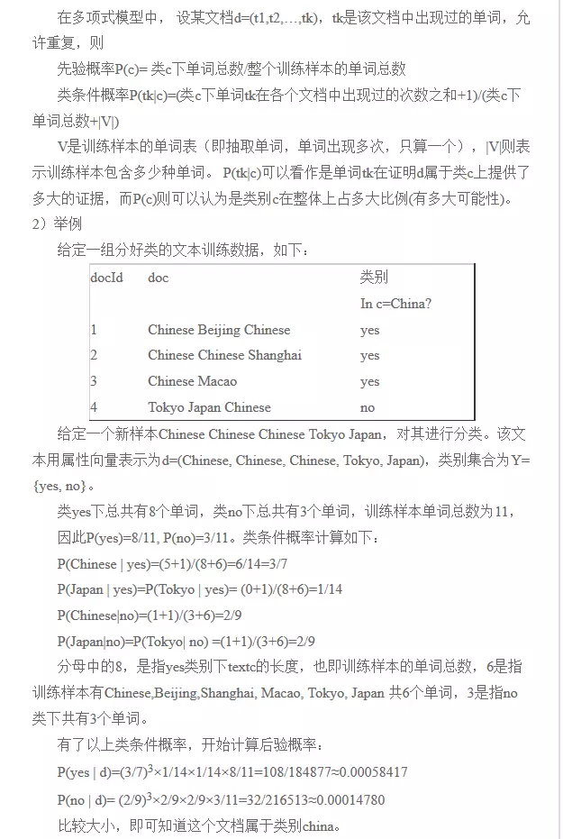
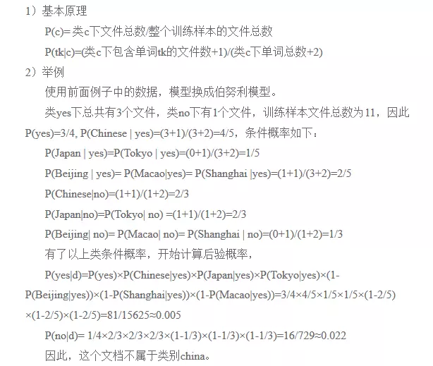
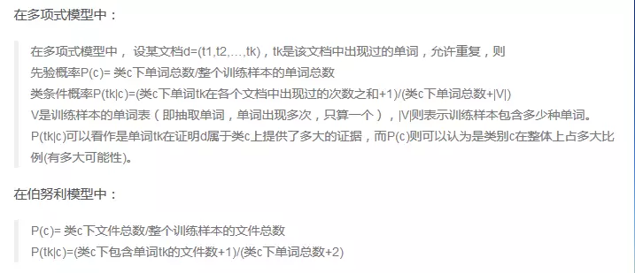

# 使用sklearn的贝叶斯分类器进行文本分类

## 1、sklearn简介 

sklearn是一个Python第三方提供的非常强力的机器学习库，它包含了从数据预处理到训练模型的各个方面。在实战使用scikit-learn中可以极大的节省我们编写代码的时间以及减少我们的代码量，使我们有更多的精力去分析数据分布，调整模型和修改超参。

## 2、朴素贝叶斯在文本分类中的常用模型：多项式、伯努利

朴素贝叶斯分类器是一种有监督学习，常见有两种模型，多项式模型(multinomial model)即为词频型和伯努利模(Bernoulli model)即文档型。二者的计算粒度不一样，多项式模型以单词为粒度，伯努利模型以文件为粒度，因此二者的先验概率和类条件概率的计算方法都不同。计算后验概率时，对于一个文档d，多项式模型中，只有在d中出现过的单词，才会参与后验概率计算，伯努利模型中，没有在d中出现，但是在全局单词表中出现的单词，也会参与计算，不过是作为“反方”参与的。这里暂不虑特征抽取、为避免消除测试文档时类条件概率中有为0现象而做的取对数等问题。

### 2.1、多项式模型 



### 2.2、伯努利模型



### 2.3、两个模型的区别 



## 3、实战演练 

使用在康奈尔大学下载的2M影评作为训练数据和测试数据，里面共同、共有1400条，好评和差评各自700条，我选择总数的70%作为训练数据，30%作为测试数据，来检测sklearn自带的贝叶斯分类器的分类效果。

___

> 读取全部数据，并随机打乱


```python
import os
import random
def get_dataset():
    data = []
    for root, dirs, files in os.walk('../dataset/aclImdb/neg'):
        for file in files:
            realpath = os.path.join(root, file)
            with open(realpath, errors='ignore') as f:
                data.append((f.read(), 0))
    for root, dirs, files in os.walk(r'../dataset/aclImdb/pos'):
        for file in files:
            realpath = os.path.join(root, file)
            with open(realpath, errors='ignore') as f:
                data.append((f.read(), 1))
    random.shuffle(data)

    return data
```


```python
data = get_dataset()
data[:2]
```


    [("Being a fan of Andy Goldsworthy's art for a while now, and owning some of his books, I had some expectations of what I would see. What I got was something completely satisfying, and quite a bit more than I expected. Being an artist myself (I work in clay), finding inspiration within our surroundings to make good art is imperative, and it is something Andy Goldsworthy has mastered. Following him over the course of a year, the director captures the spontaneous energy, skill, and devotion to the artists connection with nature with dratic inspiring flair. The music set to the film is embracing and intoxicating. If you are an artist in need of inspiration, or anyone else in need of an uplifting experience, then SEE THIS MOVIE. I for one am glad to know that Andy is somewhere out there. Creating, dancing, wrestling with the forces of nature to make our world more beautiful.",
      1),
     ("A film I expected very little from, and only watched to pass a quiet hour - but what an hour it turned out to be. Roll is an excellent if none-too-serious little story of 'country-boy-lost-in-the-big-city-makes-good', it is funny throughout, the characters are endearing and the pace is just right.<br /><br />Toby Malone is the true star of the film with his endearing portrayal of Matt, said country boy and local Aussie Rules football hero come to the big city to try out for one of the big teams. He is supported superbly by John Batchelor as local gangster Tiny. Watch out for these two.<br /><br />Highly recommended.",
      1)]


___

> 按照7:3的比例划分训练集和测试集


```python
def train_and_test_data(data_):
    filesize = int(0.7 * len(data_))
    # 训练集和测试集的比例为7:3
    train_data_ = [each[0] for each in data_[:filesize]]
    train_target_ = [each[1] for each in data_[:filesize]]

    test_data_ = [each[0] for each in data_[filesize:]]
    test_target_ = [each[1] for each in data_[filesize:]]

    return train_data_, train_target_, test_data_, test_target_
```


```python
train_data, train_target, test_data, test_target = train_and_test_data(data)
```

___

> 使用多项式贝叶斯分类器


```python
from sklearn.naive_bayes import MultinomialNB
from sklearn.pipeline import Pipeline
from sklearn.feature_extraction.text import TfidfVectorizer, HashingVectorizer, CountVectorizer
from sklearn import metrics
from sklearn.naive_bayes import BernoulliNB

nbc = Pipeline([
    ('vect', TfidfVectorizer()),
    ('clf', MultinomialNB(alpha=1.0)),
])
nbc.fit(train_data, train_target)    #训练我们的多项式模型贝叶斯分类器
predict = nbc.predict(test_data)  #在测试集上预测结果
y_score = nbc.fit(train_data, train_target).predict_proba(test_data)
print(y_score)
count = 0                                      #统计预测正确的结果个数
for left , right in zip(predict, test_target):
      if left == right:
            count += 1
print(count/len(test_target))
```

    [[0.21379806 0.78620194]
     [0.61108605 0.38891395]
     [0.25629837 0.74370163]
     ...
     [0.33889503 0.66110497]
     [0.73665026 0.26334974]
     [0.1870178  0.8129822 ]]
    0.8596


___

> 使用伯努利模型分类器


```python
nbc_1= Pipeline([
    ('vect', TfidfVectorizer()),
    ('clf', BernoulliNB(alpha=0.1)),
])
nbc_1.fit(train_data, train_target)
predict = nbc_1.predict(test_data)  #在测试集上预测结果
count = 0                                      #统计预测正确的结果个数
for left , right in zip(predict, test_target):
      if left == right:
            count += 1
print(count/len(test_target))
```

    0.8818635607321131


___

从分类结果可以看出，和多项式模型相比，使用伯努利模型的贝叶斯分类器，在文本分类方面的精度相比，差别不大，我们可以针对我们面对的具体问题，进行实验，选择最为合适的分类器。

# 作业
sklearn中一共提供了四种贝叶斯分类器：
* 高斯朴素贝叶斯
* 多项式朴素贝叶斯
* 补充朴素贝叶斯
* 伯努利朴素贝叶斯  

从四种贝叶斯分类器模型中找出具有最佳分类效果的分类器，并用直方图直观表示其分类准确率。

# 参考资料
[sklearn官方网站](https://scikit-learn.org/stable/index.html)   
https://scikit-learn.org/stable/index.html  

[sklearn:朴素贝叶斯](https://scikit-learn.org/stable/modules/naive_bayes.html#naive-bayes)     
https://scikit-learn.org/stable/modules/naive_bayes.html#naive-bayes
