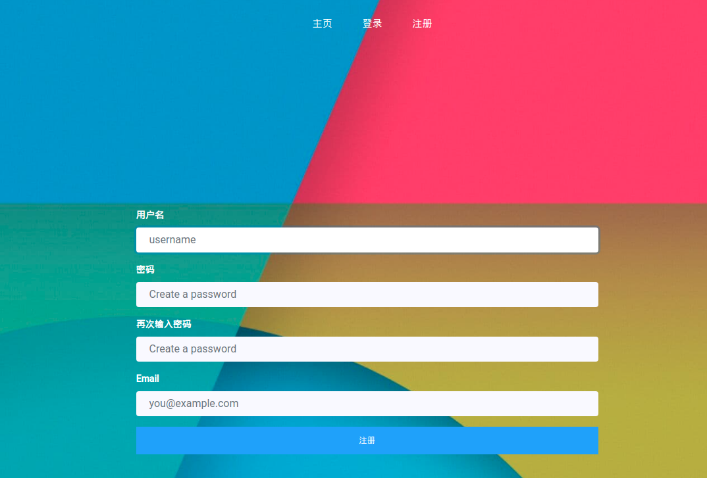
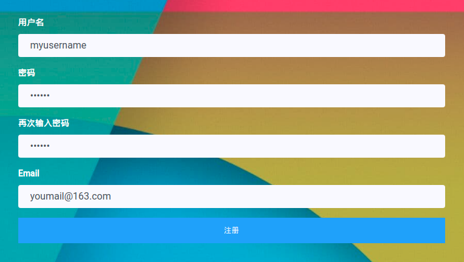
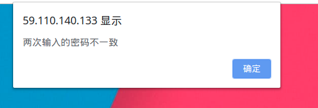
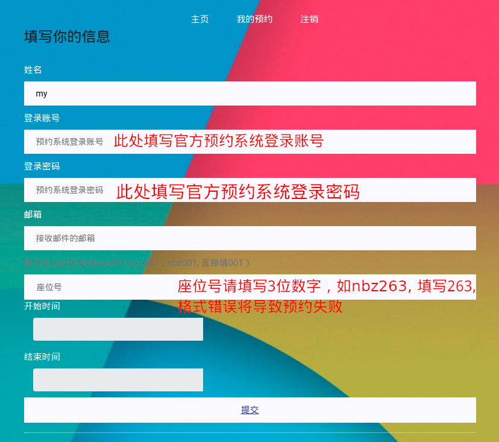
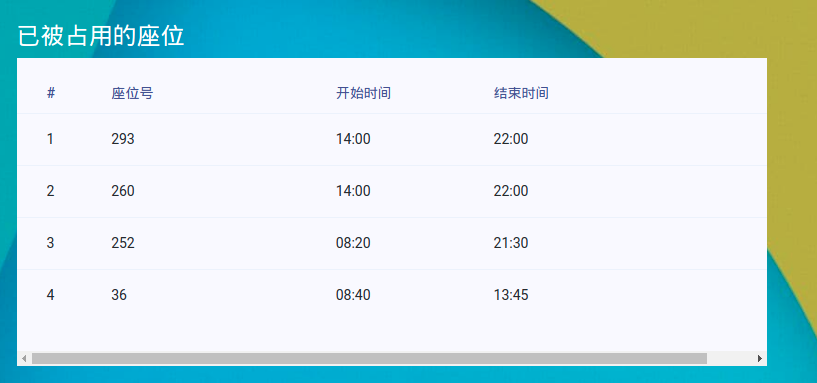
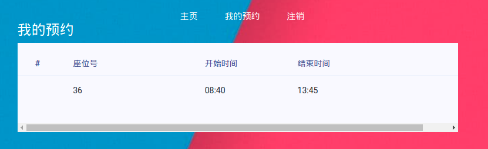

# AutoReserve | 使用说明

## 1. 简介

AutoReserve是一个帮助同学们自动预约图书馆座位的系统，提供每晚代约座位服务，由一位热心同学开发和维护。

## 2.访问站点

我们的网站是：http://59.110.140.133/reserve/ ，欢迎访问注册

## 3.如何使用

访问网站->注册账号->填写表格->**审核通过**->成功加入预约名单

### 3.1 访问并注册

访问http://59.110.140.133/reserve/主页  


点击```免费注册```或上方导航栏里的```注册```按钮进行注册，跳转到注册页面  


填写表单进行注册  


两次密码不一致会有检查提示  


注册完成后自动重定向到```我的预约```页面  


页面下方会显示系统数据库中已经被“预约”的位置  


按照提示填写表单后，页面上方会刷新出你的预约信息  


## 4. Q&A

Q： 本系统的用户名必须和预约系统的账号一样吗？

A： 不一定，你可以选择自己喜欢的用户名，比如：悲伤的雪，等等。在你填写自己的预约信息时要求的账号才是你图书馆预约系统的账号。

---

Q： 可以100%保证我每天都可以约到想要的位置吗？

A： 不一定，由于本系统也是模拟登录等行为来进行预约，因此也受到比如网络拥塞，系统卡顿等问题，因此不一定每天都可以约到想要的位置，当用户指定的位置未完成预约时，系统将自动预约与其相邻的下一个座位，保证用户有位置可坐。

---

Q： 有时注册提交表单时会出现```Internal Error 500```,这代表什么意思，是注册失败了吗？

A： ```Internal Error 500```代表服务器内部错误，由于某些未知的原因，此类错误尚无法预知并排除，出现此类错误时，通常预约已经完成，用户可再次访问网页直接登录。推荐用户在浏览器内打开网址，不建议在QQ，微信环境下直接进入网页。

---

Q： 我填写完表单后，当天就可以约到位置吗？

A： 系统在每天晚上12点为用户预约“明天”的座位，也就是说，如果用户在1月1日中午填写表单，那么系统将在1月2日的凌晨00:00为其预约1月3日的座位，此后每天晚上都会再次预约。

---

Q： 我今天不想去了，怎么才能取消今天的座位？

A： 本系统不提供取消座位服务，用户可直接登录官方预约系统微信端（ http://libzwxt.ahnu.edu.cn/SeatWx/login.aspx ） 或网页端（ http://libzwxt.ahnu.edu.cn/SeatManage/ ） 进行取消。

---

Q： 我想换个位置做，可以修改预约信息吗？

A： 用户可直接登录系统，点击上方```我的预约```导航按钮，进入```我的预约```页面修改信息。

---

Q： 一个账号可以提交多个预约信息吗？

A： 不可以，每个账号只能为一个人预约。

---

Q： 为什么我的座位没有预约成功？

A： 系统可能存在未知的BUG， 反复出现此问题请联系管理员。
