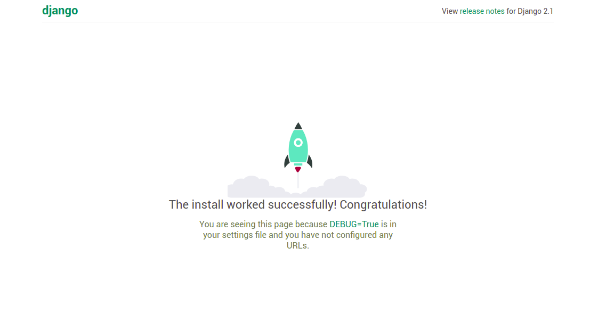

# MyHeath 项目实现过程记录

## 1、找寻网页模板
从这个网站找  https://colorlib.com/wp/templates/找到之后，简单进行修改，过程略过不提
## 2、 CODING

### 2.1、新建Django项目
首先新建django项目：django-admin startproject MyHealth进入项目目录，输入：python manage.py startapp myhealth，创建名为myhealth的app此时，可对项目进行测试，在项目根目录下运行：python manage.py runserver,则可见下图：

```python
from IPython.display import Image
Image(filename='./image/django_1.png')
```


    

    


### 2.2、基本用户管理模块

#### 2.2.1、用户数据库建立 
首先建立基本的用户数据库,django中有内置的用户认证系统，因此我们可以直接继承其User类from django.db import models
from django.contrib.auth.models import User
# Create your models here.

class NormalUser(User):
    pass

class DoctorUser(User):
    pass这时，已建立数据库相对应的模型，我们可以使用数据库迁移来创建数据库python manage.py makemigration myhealth，但是直接输入这句会报错，因为我们还没有对myhealth应用进行注册，打开MyHealth目录下的setting.py，在INSTALLED_APPS 中加入：'myhealth.apps.MyhealthConfig',即可
再使用命令python manage.py migrate，即可创建数据库
#### 2.2.2、 设置url 
为了让每一个网页都具有自己的url标识，我们还需要对网站的url进行管理打开MyHeath/urls.py
在urlpatterns里加入：path('myhealth/', include('myhealth.urls'))
再在myhealth目录下新建urls.py文件：

from django.urls import path
from . import views

urlpatterns = [
    path('', views.index, name='index'),
]