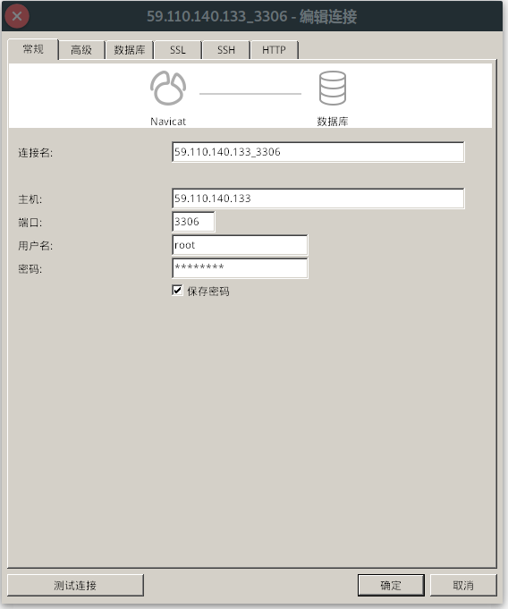
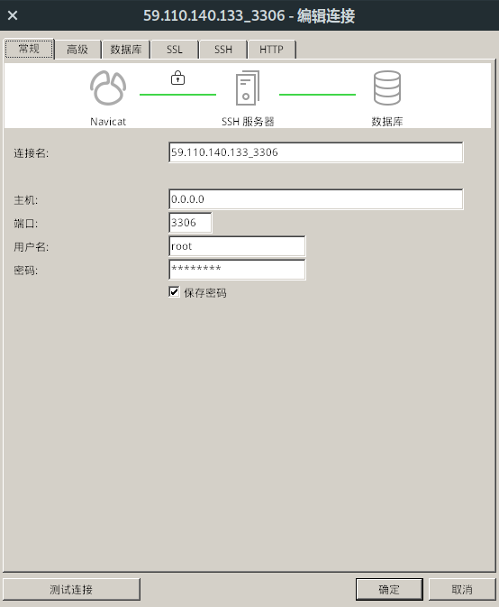
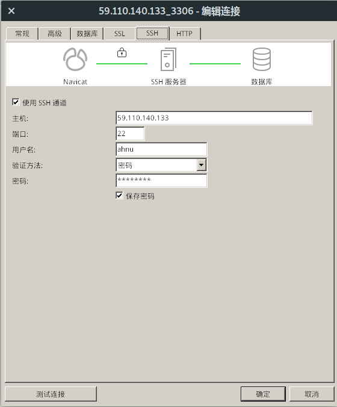

# 数据库表结构说明 && 远程访问说明

> code by lichang

# 数据库表结构说明

数据库名为django_mysql

## 1.用户  
> 所有和用户有关的数据

### 1.1 mhuse_mhuser表  
> 用户总表，包含基本用户信息  

* id(key)
* password（密文密码）
* last_login
* is_superuser
* username
* first_name
* last_name
* email
* is_staff
* is_active
* date_joined
* usertype(normal, doctor)
* deviceid （设备id）
* mypassword(明文密码)

### 1.2 mhuser_normal表  
> 普通用户表,包含普通用户的个人信息  

* **user** *(foreign key, mhuser_mhuser.id)*
* **age**  *[IntegerField, blank=True]*
* **gender** *[CharField,default='man',choice=('man','woman'), max_length=10, blank=True] (性别)*
* **weight** *[FloatField, blank=True] （体重）*
* **marry**  *[BooleanField, blank=True]（婚否）*
* **career**  *[CharField, blank=True]（职业）*
* **signature**  *[CharField, blank=True]（个性签名）*
* **medicalhistory** *[TextField, max_length=1000, blank=True] （用药史）*
* **avatar**  *[ImageField, blank=True] (头像)*

### 1.3 mhuser_doctoruser表  
> 医生用户表, 包含医生用户的基本信息

* **user** *(foreign key, mhuser_mhuser.id)*
* **age** *[IntegerField, blank=True] 
* **gender** *[CharField,default='man',choice=('man','woman'), max_length=10, blank=True] (性别)*
* **signature**  *[CharField, blank=True]（个性签名）*
* **expert** *[CharField, blank=True] (擅长)*
* **avatar**  *[ImageField, blank=True] (头像)*

### 1.4 mhuser_match表  
> 普通用户&医生匹配,包含负责项

* **normaluser** *[foreign key, mhusr_normaluser.user]*
* **doctor** *[foreign key, mhuser_doctoruser.user]*
* **charged** *[CharField, choice=(('pressure', '血压数据'),('oxygen','血氧数据'),('heartbeat', '心跳数据'),('tem', '体温数据')] (负责的部分)*

### 1.5 mhuser_temdata表
> 普通用户个人体温信息表

* **own** *[foreign key, mhuser_normaluser.user]*
* **deviceid** *[CharField, default='', max_length=50]*
* **time** *[DateTimeField]*
* **tem_value** *[IntegerField] ××.×× 整数两位，小数两位*

### 1.6 mhuser_heartdata表
> 普通用户个人心率信息表

* **own** *[foreign key, mhuser_normaluser.user]*
* **time** *[DateTimeField]*
* **deviceid** *[CharField, default='', max_length=50]*
* **b_value** *[IntegerField] 心率 3位整数*
* **q_value** *[IntegerField] 心率间隔 3位整数*
* **s_value** *[IntegerField] 信号强度 3位整数*

### 1.7 mhuser_oxygendata表
> 普通用户个人血氧信息表

* **own** *[foreign key, mhuser_normaluser.user]*
* **time** *[DateTimeField]*
* **deviceid** *[CharField, default='', max_length=50]*
* **hr_value** *[IntegerField] 心率 3位整数*
* **spo2_value** *[IntegerField] 血氧 3位整数*

### 1.8 mhuser_pressuredata表
> 普通用户个人血压信息表

* **own** *[foreign key, mhuser_normaluser.user]*
* **time** *[DateTimeField]*
* **deviceid** *[CharField, default='', max_length=50]*
* **bpss_value** *[IntegerField] 舒张压  3位整数* 
* **bpsz_value** *[IntegerField] 收缩压 3位整数*

## 2. 留言 

### 2.1  explain_explain表
> 对普通用户健康数据的评论,称留言

* **match** *[foreign key, mhuser_match]*
* **author** *[foreign key, mhuser_mhuser]*
* **touserid** *[foreign key, mhuser_normaluser]* 
* **time** *[DateTimeField]*
* **context** *[RichTextField, max_length=10000]*
* **read** *[CharField]*
> author对应fromuserid, touserid为接受意见的用户，是普通用户。

## 3. 设备

### 3.1  device_device表
> 有关设备,包含5张封面图,5张详情图

* **name** *[CharField, max_length=30]*
* **cover1** *[ImageField]*
* **cover2** *[ImageField, blank=True]*
* **cover3** *[ImageField, blank=True]*
* **cover4** *[ImageField, blank=True]*
* **cover5** *[ImageField, blank=True]*
* **label** *[TextField, max_length=50] (标签)*
* **sales** *[IntegerField, default=0] (销量)*
* **price** *[FloatField, default=0.0] (价格)*
* **detailimage1** *[ImageField, blank=True] (详情图片)*
* **detailimage2** *[ImageField, blank=True] (详情图片)*
* **detailimage3** *[ImageField, blank=True] (详情图片)*
* **detailimage4** *[ImageField, blank=True] (详情图片)*
* **detailimage5** *[ImageField, blank=True] (详情图片)*

## 4. 评论
> 对博客的评论系统

### 4.1 comment_blogcomment表
> 一级评论， 对博客进行评论  

* **author** *[foreign key, mhuser_mhuser]*
* **time** *[DateTimeField]*
* **comment** *[RichTextField] (评论内容)*
* **followed_blog** *[foreign key, blog_blog] (评论对象)*

### 4.2 comment_bottomcomment表
> 二级评论，对一级评论进行回复或自回复）  

* **author** *[foreign key, mhuser_mhuser]*
* **time** *[DateTimeField]*
* **comment** *[RichTextField] (评论内容)*
* **followed_comment** *[foreign key, blog_blog] (评论的评论对象)*
* **followed_self** *[foreign key, self] (评论的二级评论对象)*

## 5. 博客  

### 5.1 blog_blog表
> 博客的基本数据

* **author** *[foreign key, mhuser_mhuser]*
* **date** *[DateTimeField]*
* **essay** *[RichTexTextFieldtField] (博客正文)*
* **label** *[CharField, max_length=20] (标签)*
* **views** *[IntegerField, default=0] (观看次数)*

# 远程访问说明（通过navicat）

> 也可使用代码段从服务器的ip地址访问MySql默认的3306端口，或者通过服务器的ssh代理访问。具体每种语言不尽相同，不再详说。

## 1、直接访问服务器的3306端口 

> navicat配置如下：
>> 其中，用户名和密码为MySQL数据库的用户名和密码，分别是：  
>> **用户名：root**  
>> **密码：Lichang1-**  

## 2、通过ssh代理访问 

> navicat配置：
>> 常规选项卡中主机地址配置为：0.0.0.0，其他不变，另外还要开启ssh代理，选中ssh选项卡，勾选使用ssh通道，ssh具体配置如下：  
>> **主机：59.110.140.133**  
>> **端口：22**  
>> **用户名：ahnu**  
>> **密码：ahnu2019**  

配置截图如下：  
  

