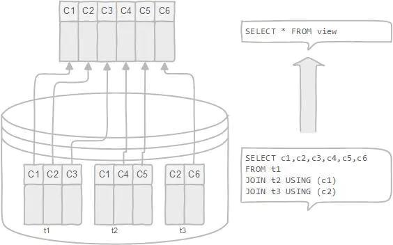

# 数据库中的视图

## 1. 什么是数据库视图

数据库视图的创建是基于SQL SELECT query和JOIN的。视图和表很相似，它也包含行和列，所以可以直接对它进行查询操作。另外大多数的数据库同样允许进行UPADTE操作，但必须满足一定的条件。视图的数据结构如图：

数据库并没有存储视图这个关系,存储的只是一个查询定义

## 2. 数据库视图可以干什么

- 视图可以简化复杂查询  
    视图的定义是基于一个查询声明，这个查询声明可能关联了很多底层表。可以使用视图向数据库的使用者或者外部程序隐藏复杂的底层表关系。
    
- 视图可以限制特定用户的数据访问权  
    有时希望对一些特定用户隐藏某些表的某些数据，这时视图可以很好的实现这个功能。
    
- 视图可以使用可计算的列  
    表的列一般都不支持动态计算，但是视图的列是支持的。假设在有一张`order_details`表，其中包含`product_nums`和`price_each`两列，当需要查询`order`总价时就需要查询出结果后在代码中进行计算，如果使用视图的话可以在视图中添加一列`total_price(product_nums*price_each)`。这样就可以直接查询出`order`的总价。
    
- 视图可以帮助兼容旧的系统  
    假设一个数据中心，这个数据中心被很多的程序在使用。如果有一天决定重新设计这个数据中心以适应一些新的业务需求，可能需要删除一些旧的表，并且创建一些新的表，但又不希望这些变动影响到那些老的程序。那么这时可以创建一些视图用来适配那些老的程序。

## 3. 如何定义数据库视图

