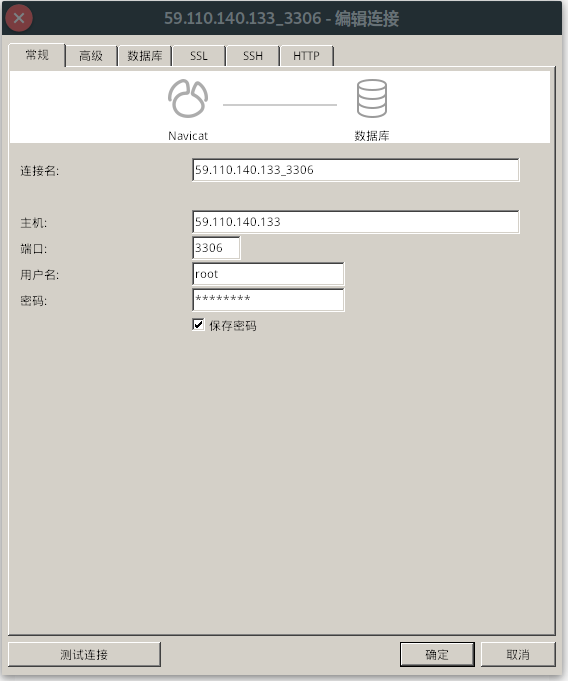
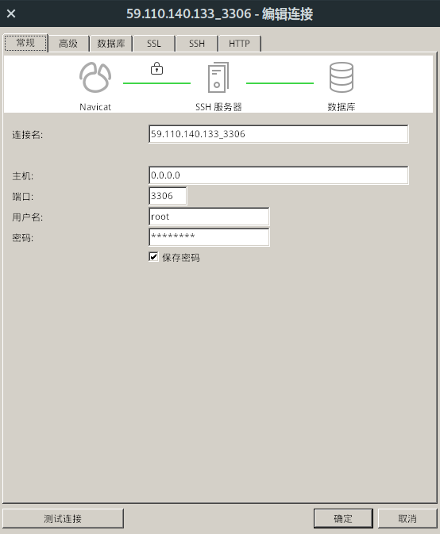
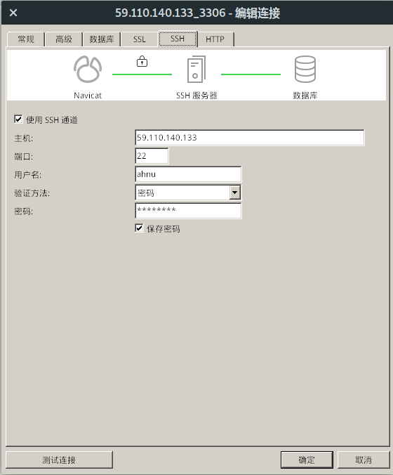

# 数据库说明

## **数据库表结构说明 && 远程访问说明**

> code by lichang

## 数据库表结构说明

数据库名为django\_mysql

### 1.用户

> 所有和用户有关的数据

#### 1.1 mhuse\_mhuser表

> 用户总表，包含基本用户信息

* id\(key\)
* password（密文密码）
* last\_login
* is\_superuser
* username
* first\_name
* last\_name
* email
* is\_staff
* is\_active
* date\_joined
* usertype\(normal, doctor\)
* deviceid （设备id）
* mypassword\(明文密码\)

#### 1.2 mhuser\_normal表

> 普通用户表,包含普通用户的个人信息

* **user** _\(foreign key, mhuser\_mhuser.id\)_
* **age**  _\[IntegerField, blank=True\]_
* **gender** _\[CharField,default='man',choice=\('man','woman'\), max\_length=10, blank=True\] \(性别\)_
* **weight** _\[FloatField, blank=True\] （体重）_
* **marry**  _\[BooleanField, blank=True\]（婚否）_
* **career**  _\[CharField, blank=True\]（职业）_
* **signature**  _\[CharField, blank=True\]（个性签名）_
* **medicalhistory** _\[TextField, max\_length=1000, blank=True\] （用药史）_
* **avatar**  _\[ImageField, blank=True\] \(头像\)_

#### 1.3 mhuser\_doctoruser表

> 医生用户表, 包含医生用户的基本信息

* **user** _\(foreign key, mhuser\_mhuser.id\)_
* **age** \*\[IntegerField, blank=True\] 
* **gender** _\[CharField,default='man',choice=\('man','woman'\), max\_length=10, blank=True\] \(性别\)_
* **signature**  _\[CharField, blank=True\]（个性签名）_
* **expert** _\[CharField, blank=True\] \(擅长\)_
* **avatar**  _\[ImageField, blank=True\] \(头像\)_

#### 1.4 mhuser\_match表

> 普通用户&医生匹配,包含负责项

* **normaluser** _\[foreign key, mhusr\_normaluser.user\]_
* **doctor** _\[foreign key, mhuser\_doctoruser.user\]_
* **charged** _\[CharField, choice=\(\('pressure', '血压数据'\),\('oxygen','血氧数据'\),\('heartbeat', '心跳数据'\),\('tem', '体温数据'\)\] \(负责的部分\)_

#### 1.5 mhuser\_temdata表

> 普通用户个人体温信息表

* **own** _\[foreign key, mhuser\_normaluser.user\]_
* **deviceid** _\[CharField, default='', max\_length=50\]_
* **time** _\[DateTimeField\]_
* **tem\_value** _\[IntegerField\] ××.×× 整数两位，小数两位_

#### 1.6 mhuser\_heartdata表

> 普通用户个人心率信息表

* **own** _\[foreign key, mhuser\_normaluser.user\]_
* **time** _\[DateTimeField\]_
* **deviceid** _\[CharField, default='', max\_length=50\]_
* **b\_value** _\[IntegerField\] 心率 3位整数_
* **q\_value** _\[IntegerField\] 心率间隔 3位整数_
* **s\_value** _\[IntegerField\] 信号强度 3位整数_

#### 1.7 mhuser\_oxygendata表

> 普通用户个人血氧信息表

* **own** _\[foreign key, mhuser\_normaluser.user\]_
* **time** _\[DateTimeField\]_
* **deviceid** _\[CharField, default='', max\_length=50\]_
* **hr\_value** _\[IntegerField\] 心率 3位整数_
* **spo2\_value** _\[IntegerField\] 血氧 3位整数_

#### 1.8 mhuser\_pressuredata表

> 普通用户个人血压信息表

* **own** _\[foreign key, mhuser\_normaluser.user\]_
* **time** _\[DateTimeField\]_
* **deviceid** _\[CharField, default='', max\_length=50\]_
* **bpss\_value** _\[IntegerField\] 舒张压  3位整数_ 
* **bpsz\_value** _\[IntegerField\] 收缩压 3位整数_

### 2. 留言

#### 2.1  explain\_explain表

> 对普通用户健康数据的评论,称留言

* **match** _\[foreign key, mhuser\_match\]_
* **author** _\[foreign key, mhuser\_mhuser\]_
* **touserid** _\[foreign key, mhuser\_normaluser\]_ 
* **time** _\[DateTimeField\]_
* **context** _\[RichTextField, max\_length=10000\]_
* **read** _\[CharField\]_

  > author对应fromuserid, touserid为接受意见的用户，是普通用户。

### 3. 设备

#### 3.1  device\_device表

> 有关设备,包含5张封面图,5张详情图

* **name** _\[CharField, max\_length=30\]_
* **cover1** _\[ImageField\]_
* **cover2** _\[ImageField, blank=True\]_
* **cover3** _\[ImageField, blank=True\]_
* **cover4** _\[ImageField, blank=True\]_
* **cover5** _\[ImageField, blank=True\]_
* **label** _\[TextField, max\_length=50\] \(标签\)_
* **sales** _\[IntegerField, default=0\] \(销量\)_
* **price** _\[FloatField, default=0.0\] \(价格\)_
* **detailimage1** _\[ImageField, blank=True\] \(详情图片\)_
* **detailimage2** _\[ImageField, blank=True\] \(详情图片\)_
* **detailimage3** _\[ImageField, blank=True\] \(详情图片\)_
* **detailimage4** _\[ImageField, blank=True\] \(详情图片\)_
* **detailimage5** _\[ImageField, blank=True\] \(详情图片\)_

### 4. 评论

> 对博客的评论系统

#### 4.1 comment\_blogcomment表

> 一级评论， 对博客进行评论

* **author** _\[foreign key, mhuser\_mhuser\]_
* **time** _\[DateTimeField\]_
* **comment** _\[RichTextField\] \(评论内容\)_
* **followed\_blog** _\[foreign key, blog\_blog\] \(评论对象\)_

#### 4.2 comment\_bottomcomment表

> 二级评论，对一级评论进行回复或自回复）

* **author** _\[foreign key, mhuser\_mhuser\]_
* **time** _\[DateTimeField\]_
* **comment** _\[RichTextField\] \(评论内容\)_
* **followed\_comment** _\[foreign key, blog\_blog\] \(评论的评论对象\)_
* **followed\_self** _\[foreign key, self\] \(评论的二级评论对象\)_

### 5. 博客

#### 5.1 blog\_blog表

> 博客的基本数据

* **author** _\[foreign key, mhuser\_mhuser\]_
* **date** _\[DateTimeField\]_
* **essay** _\[RichTexTextFieldtField\] \(博客正文\)_
* **label** _\[CharField, max\_length=20\] \(标签\)_
* **views** _\[IntegerField, default=0\] \(观看次数\)_

## 远程访问说明（通过navicat）

> 也可使用代码段从服务器的ip地址访问MySql默认的3306端口，或者通过服务器的ssh代理访问。具体每种语言不尽相同，不再详说。

### 1、直接访问服务器的3306端口

> navicat配置如下：
>
> > 其中，用户名和密码为MySQL数据库的用户名和密码，分别是：  
> > **用户名：root**  
> > **密码：Lichang1-**

### 2、通过ssh代理访问

> navicat配置：
>
> > 常规选项卡中主机地址配置为：0.0.0.0，其他不变，另外还要开启ssh代理，选中ssh选项卡，勾选使用ssh通道，ssh具体配置如下：  
> > **主机：59.110.140.133**  
> > **端口：22**  
> > **用户名：ahnu**  
> > **密码：ahnu2019**

配置截图如下：  
  

