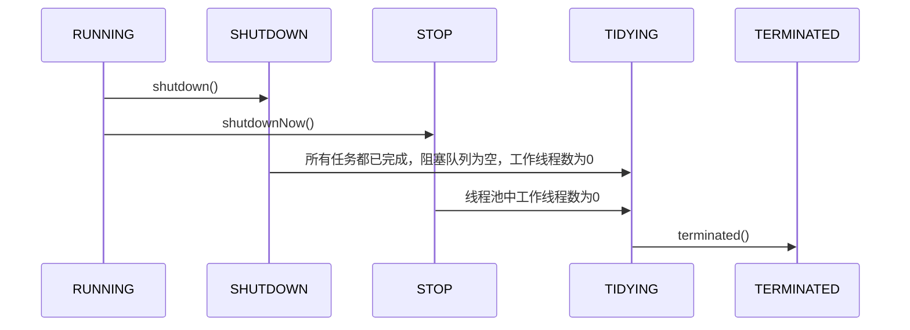

## 1. 线程池基础

### 1.1 野生线程
在我们平常的开发中，经常会有用到多线程的场景，合理利用多线程可有效利用CPU的多核结构，提高程序的执行效率。有这样一种线程：我们利用其完成一些工作，但只是将工作交给这个线程，该线程并不保证完成任务，也不保证正常退出，并且在线程开始运行后我们无法对其进行控制。这种状态可称为：野生线程，意为其已经不受控制，在内存中自由运行。

这种线程可能带来一系列问题：
- 频繁申请/销毁线程，可能带来巨大的额外消耗
- 当内存中存在较多的野生线程，会导致过分调度，降低系统性能
- 不能正常退出的线程会导致内存泄露
- 系统无法合理管理内部的资源分布，会降低系统的稳定性
- ……

鉴于以上野生线程带来的问题，我们需要一种方式将其管理起来，使其从野生的线程变成“家养”的线程。

### 1.2 什么是线程池
> 池化：池化是一种将资源统一进行管理，从而最大化收益并最小化风险的思想。

线程池维护若干个线程，在总体上控制线程的数量，具体上控制线程的创建、销毁等生命周期，系统可通过申请线程池中的线程异步的完成某个任务。线程池通过对线程的管理实现对资源的有效利用，避免系统资源浪费或内存泄露等问题。

### 1.3 使用线程池的好处
- 线程池中的线程可反复利用，减少了线程创建和销毁的开销
- 任务无需等待线程创建即可开始运行，提高了系统响应速度
- 通过设置合理的线程池线程数，可有效避免资源使用不当，资源浪费
- 对线程运行进行有效的监视与管理

通俗易懂的讲，如果将线程比作完成任务的人，那么线程池就像一个专门管理这些人的部门。当我有任务到来时，直接把任务交给该部门，而不用自己再去找人来完成任务。

## 2. 线程池的工作机制

## 2.1 线程池模型

线程池的内部实际上可以看做是生产者消费者模型，二者并不直接关联，通过任务队列进行交互，从而可以有效的缓冲任务，复用线程。

在线程池模型中，扮演生产者角色的是任务管理部分，其接受提交的任务，并判断任务应如何处理：
1. 直接申请线程执行该任务
2. 缓冲到队列中等待线程执行
3. 直接拒绝该任务

线程管理部分是消费者，线程被统一维护在线程池中，当有任务请求到来时，某一线程被分配去执行这个任务，执行完成后继续或许新的任务来执行，最终当线程获取不到任务时，线程就被回收以节省系统资源。

### 2.2 线程池的状态
线程池一方面维护自身的状态，另一方面管理线程和任务，使二者良好的结合从而执行并行任务。
线程池的状态有5种：
|运行状态|状态描述|
|-----|-----|
|RUNNING|能接受新提交的任务，并且也能处理阻塞队列中的任务|
|SHUTDOWN|关闭状态，不再接受新提交的任务，但可以继续处理阻塞队列中已保存的任务|
|STOP|不能接受新任务，也不处理队列中的任务，会中断正在处理任务的线程|
|TIDYING|所有的任务都已终止，有效线程数为0|
|TERMINATED|在terminated()方法执行后进入该状态|
其生命周期转换如下图所示：

### 2.3 任务执行机制

#### 2.3.1 任务调度
任务调度是线程池的主要入口，用户提交任务后，这部分将决定任务如何执行。
任务调度的流程图如下：

1. 提交任务后，首先检测运行池状态，若不是RUNNING，则直接拒绝，线程池要保证在RUNNING状态下执行任务。
2. 如果线程数小于核心数，说明系统还没有被充分利用，则可添加线程并执行。若线程数大于核心数，此时再一味增加线程数只会带来调度开销，则将任务放入阻塞队列。
3. 若阻塞队列未满，则将任务放入阻塞队列等待执行，否则进行下一步。
4. 若线程数小于最大线程数，可添加工作线程执行，若线程数已大于等于最大线程数，此时直接拒绝任务，不予执行。

#### 2.3.2 任务缓冲
线程池的本质是对任务和线程的管理，要让二者分别独立运行。如果不使用线程池，一个任务即一个线程，对任务与线程的管理都将陷入混乱。要分别对任务和线程进行管理，则需要将二者进行解耦，不让二者直接关联。线程池以消费者-生产者模型，通过一个阻塞队列实现二者的解耦。阻塞队列缓存任务，工作线程从阻塞队列中获取任务。

阻塞队列(BlockingQueue)是一个支持两个附加操作的队列。这两个附加的操作是：
1. 在队列为空时，获取元素的线程会等待队列变为非空。
2. 当队列满时，存储元素的线程会等待队列可用。
阻塞队列常用于生产者和消费者的场景，生产者是往队列里添加元素的线程，消费者是从队列里拿元素的线程。阻塞队列就是生产者存放元素的容器，而消费者也只从容器里拿元素。
其工作模式如下：

#### 2.3.3 任务申请
从上文[任务调度](#231-任务调度)部分可知，任务的执行有两种可能：
1. 任务直接由新创建的线程执行
2. 线程从任务队列中获取任务然后执行，执行完任务的空闲进行再次去队列中申请任务执行
第一种情况仅在线程初始创建时出现，多数情况下是第二种情况

线程要从任务缓存模块中不断获取任务执行，定义getTask方法来帮助线程从阻塞队列中获取任务，实现线程管理模块和任务管理模块的通信。其执行流程如下：

这里进行了多次判断，目的在于控制线程的数量，使其符合线程池的状态。如果线程池现在不应该持有那么多线程，则会返回null值。工作线程Worker会不断接收新任务去执行，而当工作线程Worker接收不到任务的时候，就会开始被回收。

#### 2.3.4 任务拒绝
任务拒绝模块是线程池的保护部分。当线程池的任务缓存队列已满，并且线程数达到设定的最大值，就需要拒绝到来的任务，保护线程池。

### 2.4 Worker线程管理

#### 2.4.1 Worker线程
线程池为了掌握线程的状态并维护线程的生命周期，设计了线程池内的工作线程Worker。   
Worker持有一个线程thread和一个初始化的任务firstTask。thread是在Worker创建时创建的线程，可用来执行任务；firstTask保存传入的第一个任务，这个任务可以有也可以为空。如果此值非空，那么Worker会先执行这个任务，再去获取任务执行；如果此值为空，那么Worker直接去阻塞队列中获取任务执行。

线程池需要管理线程的生命周期，需要在线程长时间不运行的时候进行回收。线程池使用一张Hash表去持有线程的引用，这样可以通过添加引用、移除引用这样的操作来控制线程的生命周期。这个时候重要的就是如何判断线程是否在运行。

​Worker是通过继承AQS，使用AQS来实现独占锁这个功能。没有使用可重入锁ReentrantLock，而是使用AQS，为的就是实现不可重入的特性去反应线程现在的执行状态。

1.lock方法一旦获取了独占锁，表示当前线程正在执行任务中。 2.如果正在执行任务，则不应该中断线程。 3.如果该线程现在不是独占锁的状态，也就是空闲的状态，说明它没有在处理任务，这时可以对该线程进行中断。 4.线程池在执行shutdown方法或tryTerminate方法时会调用interruptIdleWorkers方法来中断空闲的线程，interruptIdleWorkers方法会使用tryLock方法来判断线程池中的线程是否是空闲状态；如果线程是空闲状态则可以安全回收。

在线程回收过程中就使用到了这种特性，回收过程如下图所示：

#### 2.4.2 Worker线程增加
增加线程是通过线程池中的addWorker方法，该方法的功能就是增加一个线程，该方法不考虑线程池是在哪个阶段增加的该线程，这个分配线程的策略是在上个步骤完成的，该步骤仅仅完成增加线程，并使它运行，最后返回是否成功这个结果。addWorker方法有两个参数：firstTask、core。firstTask参数用于指定新增的线程执行的第一个任务，该参数可以为空；core参数为true表示在新增线程时会判断当前活动线程数是否少于corePoolSize，false表示新增线程前需要判断当前活动线程数是否少于maximumPoolSize，其执行流程如下图所示：

#### 2.4.3 Worker线程回收
线程池中线程的销毁依赖JVM自动的回收，线程池做的工作是根据当前线程池的状态维护一定数量的线程引用，防止这部分线程被JVM回收，当线程池决定哪些线程需要回收时，只需要将其引用消除即可。Worker被创建出来后，就会不断地进行轮询，然后获取任务去执行，核心线程可以无限等待获取任务，非核心线程要限时获取任务。当Worker无法获取到任务，也就是获取的任务为空时，循环会结束，Worker会主动消除自身在线程池内的引用。

事实上，将线程引用移出线程池就已经结束了线程销毁的部分。但由于引起线程销毁的可能性有很多，线程池还要判断是什么引发了这次销毁，是否要改变线程池的现阶段状态，是否要根据新状态，重新分配线程。

#### 2.4.4 Worker线程执行任务
在Worker类中的run方法调用了runWorker方法来执行任务，runWorker方法的执行过程如下：

1.while循环不断地通过getTask()方法获取任务。 2.getTask()方法从阻塞队列中取任务。 3.如果线程池正在停止，那么要保证当前线程是中断状态，否则要保证当前线程不是中断状态。 4.执行任务。 5.如果getTask结果为null则跳出循环，执行processWorkerExit()方法，销毁线程。

