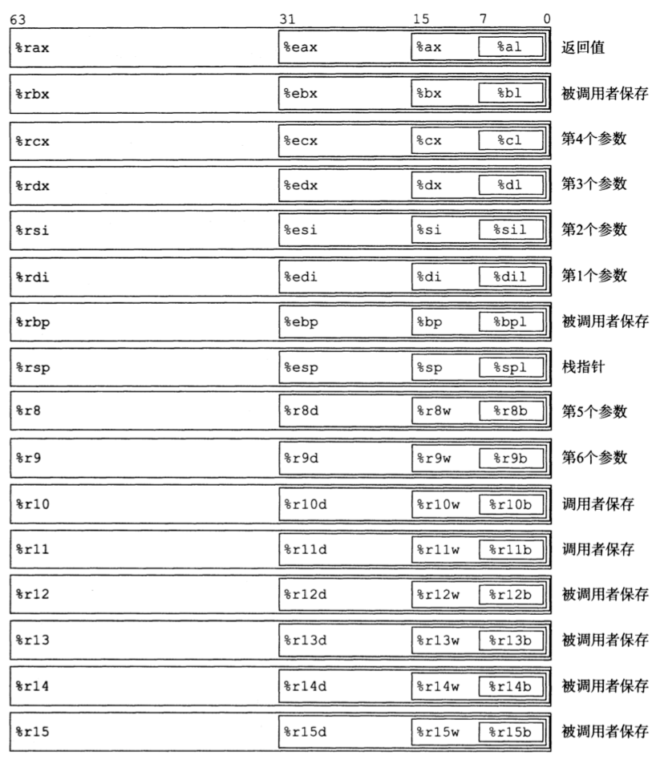
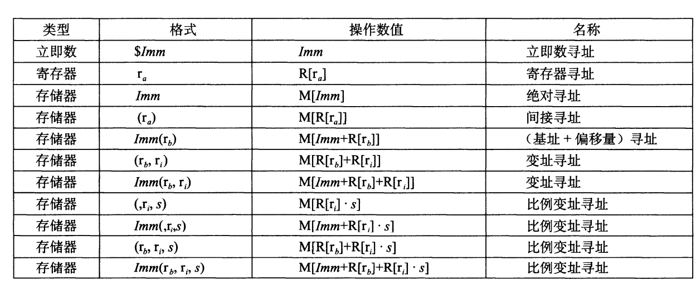
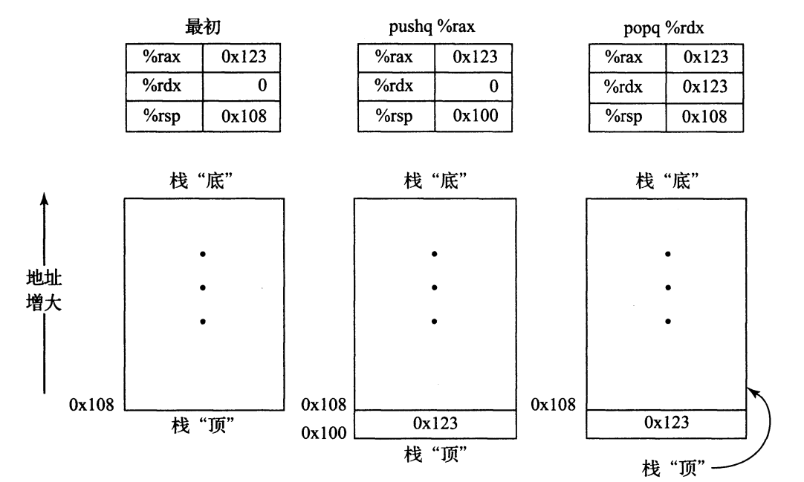
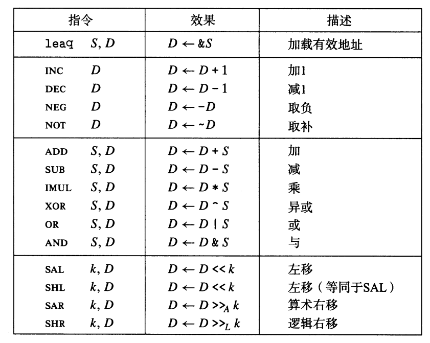
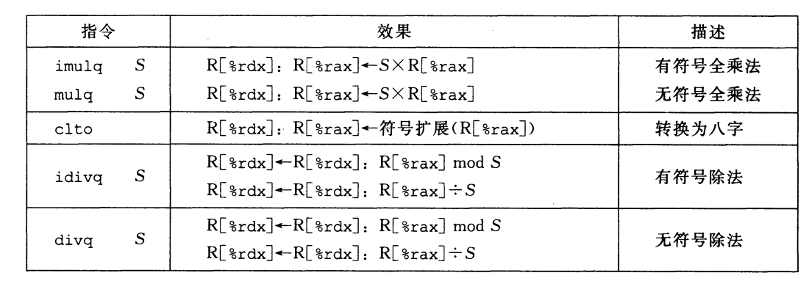

# 基本计算指令

> 这里的汇编指令均基于x86-64架构

## 0. 先验知识

### 0.1 寄存器设置



一个x86-64的中央处理单元包含一组16个64位通用目的寄存器。这些寄存器用来存储整数数据和指针。指令可以对这16个寄存器的低位字节中存放的不同大小的数据进行操作。字节级操作可以访问最低的字节，16位操作可以访问最低的2个字节，32位操作可以访问最低的4个字节，而64位操作可以访问整个寄存器。

### 3. 寻址方式



## 1. 数据传送指令

最简单形式的数据传送指令--mov类。这些指令把数据从源位置复制到目的位置，不做任何变化。mov类指令由四条指令组成：`movb, movw, movl,movq`.这些指令都执行相同的操作，区别在于它们操作的数据大小不同：分别是1，2，4，8字节。

> 由于历史原因，Intel处理器将16位作为一个字`（w）`，8位为一个字节`(b)`，32位为双字`(l)`,64位为4字`（q）`

|指令|效果|描述|
|-----|-----|-----|
|**MOV    S    D**| **D  <-  S**| 传送|
|movb||传送字节|
|movw||传送字|
|movl||传送双字|
|movq||传送四字|
|movabsq  **I, R** ||传送绝对的四字|

传送指令的两个操作数不能都指向内存位置。将一个值从一个内存位置复制到另一个内存位置需要两个步骤，第一个指令将源值加载到寄存器，第二条指令将该寄存器写入目的位置。

**example**
> C code
```C
long exchange(lone *xp, long y){
    long x = *xp;
    *xp = y;
    return x;
}
```

> 汇编代码
```
exchange:
    movq (%rdi), %rax     get x at xp, Set as return value
    movq %rsi, (%rdi)     Store y at xp.
    ret
```

## 2. 压栈和出栈

在x86-64中，程序栈存放在内存中某个区域，栈向下增长，这样，栈顶元素的地址是所有栈中元素地址最低的。栈指针`%rsp`保存着栈顶元素的地址。 

`pushq`指令的功能是把数据压入到栈上，而`popq`指令是弹出数据。这些指令都只有一个操作数--压入的数据源和弹出的数据目的。  
将一个四字值压入栈中，首先要将栈指针减8，然后再将值写入到新的栈顶地址。因此，`pushq %rbp`的行为等价于下面两条命令：
```
subq $8, %rsp         Decrement stack pointer
movq %rbp, (%rsp)     Store %rbp on stack
```

弹出一个四字的操作包括从栈顶位置读出数据，然后将栈指针加8，因此，指令`popq %rax`等价于下面两条指令：
```
movq (%rsp) , %rax        Read %rax from stack
addq $8, %rsp             Increment stack pointer
```

**example**


## 3. 算术和逻辑操作

> 每个指令类都有`b, w, l, q`这四种不同大小的指令

**算术和逻辑操作指令**  



### 3.1 加载有效地址

加载有效地址（load effective address）指令`leaq`实际上是`movq`指令的变形。它的指令形式是从内存读数据到寄存器，但实际上它根本就没有引用内存。它的第一个操作数看上去是一个内存引用，但该指令并不是从指定的位置读入数据，而是将有效地址写入到目的操作数。  
`lea`还可以简洁的描述普通的算术操作。例如，如果寄存器`%rdx`的值为`x`， 那么指令`leaq 7(%rdx, %rdx, 4),%rax`将设置寄存器`%rax`的值为`5x+7`

**example**  
> c code
```C
long scale(long x, long y, long z){
    long t = x + 4 * y + 12 * z;
    return t;
}
```

> 汇编指令
```
lone scale(long x, long y, long z)
x in %rdi, y in %rsi, z in %rdx
scale:
    leaq (%rdi, %rsi, 4), %rax      x + 4 * y
    leaq (%rdx, %rdx, 2), %rax      z + 2 * z = 3 * z
    leaq (%rax, %rdx, 4), %rax      (x+4×y) + 4*(3*z) = x + 4*y + 12*z
    ret
```

### 3.2 一元和二元操作

上表中的第二组中的操作是一元操作，只有一个操作数，既是源又是目的。这个操作数可以是寄存器，也可以是内存位置。比如说，指令`incq (%rsp)`会使栈顶的8字节元素+1.  

第三组是二元操作，其中第二个操作数既是源又是目的。不过，要注意，源操作数是第一个，目的操作数是第二个，对于不可交换来说，这看上去很奇特。例如，指令`subq %rax, %rdx`使寄存器`%rdx`的值减去`%rax`中的值。

### 3.3 移位操作

最后一组是移位操作，先给出移位量，然后第二项给出的是要移位的数。可以进行算术和逻辑右移。移位量可以是一个立即数，或者放在单字节寄存器`%cl`中。  

左移指令有两个名字：`sal`和`shl`。二者的效果是一样的，都是将右边填上0.右移指令不同，`sar`执行算术移位（填上符号位），而`shr`执行逻辑移位（填上0）.

> 当寄存器`%cl`的十六进制值为0xFF时，指令`salb`会移7位，`salw`会移15为，`sall`会移31位，`salq`会移63位`

### 3.4 特殊的算术操作

两个64位有符号或无符号整数相乘得到的乘积需要128位来表示。intel把16字节的数成为*八字*（oct word）.   
> 特殊的算术操作    



**example: 如何从两个无符号64位数字x和y生成128位的乘积**
> c code
```C
#include<inttypes.h>

typedef unsigned __int128 uint128_t

void store_uprod(uint128_t *dest, uint64_t x, uint64_t y){
    *dest = x * (uint128_t) y;
}
```

> 汇编代码
```
dest in %rdi, x in %rsi, y in %rdx
store_uprod:
    movq %rsi, %rax          copy x to multiplicand
    mulq %rdx                multiply by y
    movq %rax, (%rdi)        store lower 8 bytes at dest
    movq %rdx, 8(%rdi)       store upper 8 bytes at dest+8
    ret
```

**example： 如何实现除法**
> c code
```C
void remdiv(long x, long y, long *qp, long *rp){
    long q = x/y;
    long r = x%y;
    *qp = q;
    *rp = r;
}
```

> 汇编代码
```
x in %rdi, y in %rsi, qp in %rdx, rp in %rcx
remdiv:
    movq %rdx, %r8       copy qp
    movq %rdi, %rax      mov x to lower 8 bytes of divident
    cqto
    idivq %rsi           divide by y
    movq %rax, (%r8)     store quotient at qp
    movq %rdx, (%rcx)    store remainder at rp
```

> cqto指令不需要操作数，它隐含读出%rax的符号位，并将它复制到%rdx的所有位
